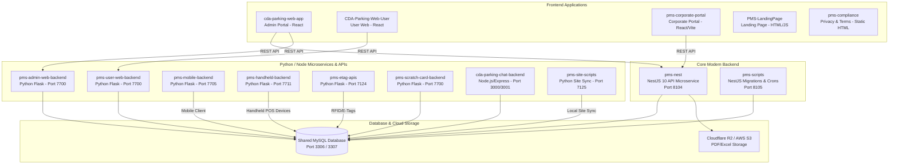

# Parking Management System (PMS) — Projects & Ecosystem Catalog

This document provides a comprehensive overview of all 15 software projects and microservices residing within the `E:\projects\pms\` ecosystem. It describes their architecture, tech stack, network ports, responsibilities, and how they interact to form the unified Smart Parking solution.

---

## 1. High-Level Ecosystem Architecture

---

## 2. Master Project Directory & Matrix

| # | Project Directory | Layer / Type | Tech Stack | Default Port | Primary Function |
|---|---|---|---|---|---|
| **1** | `pms-nest` | Core Backend API | NestJS 10, TypeScript, Objection.js, Knex, MySQL | `8104` | Modern modular API gateway (Corporate Cards, Tickets, Shift Closing, Sites, Hardware, Gateways). |
| **2** | `cda-parking-web-app` | Frontend (Admin) | React.js, Redux, Bootstrap, Chart.js, Axios | `7102` / `7781` | Centralized administration portal for city parking management, live monitoring, tariffs, and reporting. |
| **3** | `CDA-Parking-Web-User` | Frontend (User) | React.js, Bootstrap, Axios, Google Maps, jsPDF | `7103` / `5000` | Citizen/driver web portal for finding parking, tracking tickets, payment history, and generating QR codes. |
| **4** | `pms-corporate-portal` | Frontend (Corporate) | React, Vite, Tailwind CSS, Redux Toolkit, Axios | `5173` | Corporate client portal for fleet management, corporate RFID cards, corporate QR passes, and billing. |
| **5** | `pms-mobile-backend` | Backend Microservice | Python 3, Flask, MySQL, Firebase Admin SDK, PyJWT | `7705` | Dedicated API for customer iOS/Android mobile apps (bookings, parking search, wallet, payment gateways). |
| **6** | `pms-handheld-backend` | Backend Microservice | Python 3, Flask, MySQL, Cryptography | `7711` | Real-time synchronization API for TicketEase POS handheld devices used by on-site parking attendants. |
| **7** | `pms-admin-web-backend` | Backend Microservice | Python 3, Flask, MySQL, Fernet, SMTP | `7700` | Administrative backend handling legacy admin web functions, audit logs, and complex reporting queries. |
| **8** | `pms-user-web-backend` | Backend Microservice | Python 3, Flask, MySQL, SMTP (Office365) | `7700` | Backend API for user web authentication, profile management, and password reset workflows. |
| **9** | `pms-etag-apis` | Backend Microservice | Python 3, Flask, Firebase Admin SDK, MySQL | `7124` | Automated E-Tag and RFID toll/barrier integration for frictionless vehicle entry and exit verification. |
| **10** | `pms-scratch-card-backend`| Backend Microservice | Python 3, Flask, MySQL, SMTP | `7700` | Management of pre-paid physical scratch cards, voucher batch activation, inventory, and redemption. |
| **11** | `cda-parking-chat-backend`| Backend Microservice | Node.js, Express, Sequelize ORM, MySQL, Fernet | `3000` / `3001` | Intelligent conversational chatbot and customer support service for CDA parking queries. |
| **12** | `pms-scripts` | Backend Utilities | NestJS, TypeScript, Knex Migrations, BullMQ | `8105` | Scheduled background workers, automated database migrations, data aggregations, and entity generators. |
| **13** | `pms-site-scripts` | On-Premise Daemon | Python 3, Socket / HTTP Sync, MySQL | `7125` | Local synchronization daemon deployed on physical parking sites for offline-resilient edge gate controllers. |
| **14** | `PMS-LandingPage` | Frontend (Marketing) | HTML5, Vanilla CSS, JavaScript | `7119` | Public marketing landing page introducing the mobile apps, parking site directory, and account deletion. |
| **15** | `pms-compliance` | Frontend / Legal | Static HTML, Nginx Deployment Scripts | `N/A` | Legal policy pages including Terms & Conditions and Privacy Policy for Play Store / App Store compliance. |

---

## 3. Detailed Project Breakdown

### 1. `pms-nest` (Core NestJS Backend)
- **Path:** `E:\projects\pms\pms-nest`
- **Stack:** NestJS 10, TypeScript, Objection.js, Knex, MySQL, Redis / CacheManager, Cloudflare R2 / AWS S3.
- **Port:** `8104`
- **Key Modules:**
  - `Auth`: JWT authentication, role-based guards (`AdminGuard`, `JwtAuthGuard`), user session context.
  - `Parking Sites`: Site configurations, tariffs, geo-coordinates, entry counts, and capacity monitor.
  - `Parking Tickets`: Parking token generation, ticket validation, fee calculation, and payment reconciliation.
  - `Parking Shift Closing`: Shift closing reports, cash collection breakdowns, supervisor approvals, and audit logs.
  - `Corporate Cards`: Corporate RFID/NFC cards, balance allocation, company-vehicle mappings.
  - `Hardware`: Device directory (Handhelds, ANPR Cameras, Barriers, POS terminals) and site assignment.
  - `Payment Gateway`: Kuickpay, Easypaisa, JazzCash, 1Link integration abstractions.
  - `Dashboard`: Aggregated revenue metrics, entry/exit analytics, and real-time site status.

---

### 2. `cda-parking-web-app` (Admin Web Portal)
- **Path:** `E:\projects\pms\cda-parking-web-app`
- **Stack:** React.js, Redux, Bootstrap, Chart.js, Axios, HTML2Canvas, FileSaver.
- **Port:** `7102` / `7781`
- **Key Capabilities:**
  - Complete control room dashboard for parking administrators and city authorities.
  - Interactive Google Maps interface showing parking occupancy across all city sites.
  - Financial auditing: Shift closing reconciliation, payment method analytics (Cash, POS, App, Corporate).
  - Tariff rate configuration: Hourly rates, grace periods, vehicle category surcharges (Bikes, Cars, Buses).
  - Operator & Attendant staff provisioning and hardware device allocation.

---

### 3. `CDA-Parking-Web-User` (Citizen / End-User Portal)
- **Path:** `E:\projects\pms\CDA-Parking-Web-User`
- **Stack:** React.js, Bootstrap, Google Maps React, jsPDF AutoTable, Moment.js, QRCode.
- **Port:** `7103` / `5000`
- **Key Capabilities:**
  - Search available parking sites nearby with navigation links and active tariffs.
  - View digital parking receipts, token status, and vehicle entry/exit history.
  - Online bill pay and invoice PDF download for parking fees.
  - Generate user QR codes for quick barrier entry and exit validation.

---

### 4. `pms-corporate-portal` (Corporate Client Portal)
- **Path:** `E:\projects\pms\pms-corporate-portal`
- **Stack:** React, Vite, Tailwind CSS, Redux Toolkit, Axios, jsPDF, QRCode.
- **Port:** `5173`
- **Key Capabilities:**
  - Designed for enterprise clients, delivery fleets, ride-hailing companies, and commercial tenants.
  - Bulk management of company vehicles and authorized license plate numbers.
  - Corporate RFID Card balance management, top-ups, and transaction tracking.
  - Corporate QR code issuance for employees and visitors.
  - Monthly corporate invoicing and automated statement downloads.

---

### 5. `pms-mobile-backend` (Customer Mobile App API)
- **Path:** `E:\projects\pms\pms-mobile-backend`
- **Stack:** Python 3, Flask, MySQL Connector, Firebase Admin SDK, PyJWT, Cryptography.
- **Port:** `7705` (Microservice) / `7788`
- **Key Capabilities:**
  - REST API serving iOS and Android mobile apps for drivers and citizens.
  - User registration, OTP mobile verification, and biometric login support.
  - In-app digital wallet: Top-ups, transaction logs, and auto-deduction on barrier exit.
  - Push notifications via Firebase Cloud Messaging (FCM) for entry alerts, overstay warnings, and receipts.
  - Multi-channel payment gateway integrations for instant ticket checkout.

---

### 6. `pms-handheld-backend` (Attendant POS Device Sync API)
- **Path:** `E:\projects\pms\pms-handheld-backend`
- **Stack:** Python 3, Flask, MySQL Connector, Fernet Encryption.
- **Port:** `7711`
- **Key Capabilities:**
  - High-throughput synchronization endpoint for handheld Android POS terminals (TicketEase).
  - Generates instant thermal-printed QR code receipts upon vehicle entry.
  - Offline receipt caching and automatic cloud sync when connectivity is restored.
  - Shift closing collection calculations for cashiers and booth attendants.
  - Verifies device hardware serials (`uniqueId` / `ipOrApi`) against authorized parking sites.

---

### 7. `pms-admin-web-backend` (Admin Portal Legacy API)
- **Path:** `E:\projects\pms\pms-admin-web-backend`
- **Stack:** Python 3, Flask, MySQL, Fernet Encryption, SMTP Mailer.
- **Port:** `7700`
- **Key Capabilities:**
  - Powers administrative reporting, user role assignment, and site configuration endpoints.
  - Generates analytical summaries and audit trail logs for city municipality oversight.

---

### 8. `pms-user-web-backend` (User Web API & Password Reset)
- **Path:** `E:\projects\pms\pms-user-web-backend`
- **Stack:** Python 3, Flask, MySQL, Office 365 SMTP.
- **Port:** `7700`
- **Key Capabilities:**
  - User authentication and session management for the user web portal.
  - Secure password reset via time-limited email tokens sent through Office 365 SMTP.

---

### 9. `pms-etag-apis` (RFID & Automatic Gate Integration)
- **Path:** `E:\projects\pms\pms-etag-apis`
- **Stack:** Python 3, Flask, Firebase Admin SDK, MySQL.
- **Port:** `7124`
- **Key Capabilities:**
  - Interfaces with long-range RFID readers and ANPR (Automatic Number Plate Recognition) cameras.
  - Validates active E-Tag subscriptions and automatically sends barrier open signals.
  - Real-time event logging of automated lane entries and exits.

---

### 10. `pms-scratch-card-backend` (Voucher & Scratch Card Service)
- **Path:** `E:\projects\pms\pms-scratch-card-backend`
- **Stack:** Python 3, Flask, MySQL, SMTP.
- **Port:** `7700`
- **Key Capabilities:**
  - Manages physical pre-paid scratch cards sold at retail booths.
  - PIN code validation, serial number hashing, and wallet credit redemption.
  - Batch activation and fraud prevention mechanisms.

---

### 11. `cda-parking-chat-backend` (Interactive Chatbot API)
- **Path:** `E:\projects\pms\cda-parking-chat-backend`
- **Stack:** Node.js, Express, Sequelize ORM, MySQL, Helmet, Express-Rate-Limit.
- **Port:** `3000` / `3001`
- **Key Capabilities:**
  - Provides natural language automated customer assistance for parking inquiries.
  - Inquires ticket status, parking availability, rates, and FAQs.

---

### 12. `pms-scripts` (Background Cron Jobs & Migrations)
- **Path:** `E:\projects\pms\pms-scripts`
- **Stack:** NestJS, TypeScript, Knex Migrations, BullMQ, Redis.
- **Port:** `8105`
- **Key Capabilities:**
  - Automated database schema migrations (`knex migrate:latest`) and rollbacks.
  - Database entity class generation from raw database schemas.
  - Nightly shift closing aggregations, expired token cleanups, and billing batch processing.

---

### 13. `pms-site-scripts` (Edge Device Synchronizer)
- **Path:** `E:\projects\pms\pms-site-scripts`
- **Stack:** Python 3, Local Socket Server, HTTP Client.
- **Port:** `7125`
- **Key Capabilities:**
  - Deployed locally on industrial PCs or Raspberry Pi controllers at physical parking lots.
  - Bridges local barrier hardware, loop detectors, and display boards with cloud APIs.
  - Ensures offline operations continue seamlessly when internet drops.

---

### 14. `PMS-LandingPage` (Marketing Landing Page)
- **Path:** `E:\projects\pms\PMS-LandingPage`
- **Stack:** HTML5, Modern CSS3, JavaScript.
- **Port:** `7119`
- **Key Capabilities:**
  - Showcases the Smart Parking System features, app download links (App Store / Google Play).
  - Contains mandatory Play Store / App Store Account Deletion self-service form.

---

### 15. `pms-compliance` (Legal Compliance Pages)
- **Path:** `E:\projects\pms\pms-compliance`
- **Stack:** Static HTML, Bash Nginx automation scripts (`deploy.sh`).
- **Port:** Hosted via Nginx (`smartparking-frontend`)
- **Key Capabilities:**
  - Serves official `privacyPolicy.html` and `termAndConditions.html`.
  - Used for mobile application store compliance and payment gateway agreements.

---

## 4. Key Database Tables & Entities Reference

The entire ecosystem communicates over a centralized MySQL schema (`pms`). Core tables include:

- `parking_site`: Defines physical parking sites, capacities, rates, and company ownership.
- `parking_token`: Core transactional entity tracking vehicle entries, exit timestamps, tariffs, and status.
- `parking_receipt`: Handheld and POS thermal receipts issued by attendants.
- `parking_shift_closing`: Cash collections and shift handover summaries.
- `hardware`: Registered devices (handhelds, cameras, POS, barriers) mapped to sites (`asignee`).
- `corporate`: Corporate company profiles and account balances.
- `corporate_cards`: Physical and digital RFID cards assigned to corporate users.
- `user`: System users, mobile app users, attendants, supervisors, and admins.
- `payment_gateway`: Configuration for online payment providers and credentials.

---

## 5. Development & Running Summary

| Project | Start Command (Dev) | Dependencies Install |
|---|---|---|
| `pms-nest` | `npm run dev` | `npm install` |
| `cda-parking-web-app` | `npm start` | `npm install` |
| `CDA-Parking-Web-User` | `npm start` | `npm install` |
| `pms-corporate-portal` | `npm run dev` | `npm install` |
| `pms-scripts` | `npm run dev` | `npm install` |
| `cda-parking-chat-backend` | `npm run dev` | `npm install` |
| Python Backends (`mobile`, `handheld`, `etag`, `admin`, `user`) | `python <mainScript>.py` | `pip install -r requirements.txt` |

---
*Maintained by the PMS Engineering Team.*
